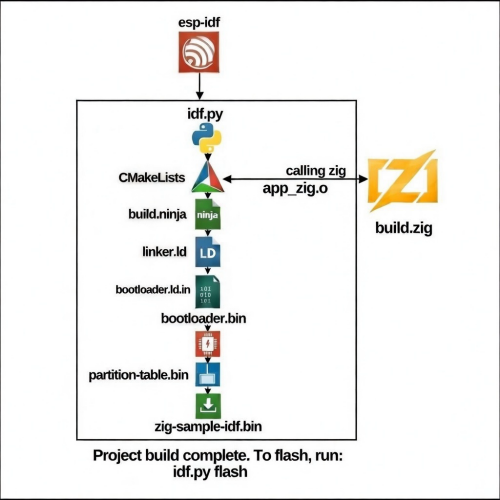

## How does the mixin build-system work?

#### Intro

ESP-IDF uses `idf.py` script is a wrapper around CMake and is responsible for creating the build environment and running CMake to generate the build files, with ninja to build the project.
However, zig build-system (`build.zig`) is a wrapper around the zig compiler.

For more details about zig commands, see [doc/zig-xtensa](zig-xtensa.md)

#### Building this project

After cloning this project, you need to install ESP-IDF and set up the environment:

1. Install ESP-IDF by following the official guide:
   - Clone ESP-IDF repository: `git clone --recursive https://github.com/espressif/esp-idf.git`
   - Run the installation script:
     - Windows: `install.bat`|`install.ps1`
     - Posix: `./install.sh`

2. Set up the ESP-IDF environment variables:
   - Windows: run `export.bat`|`./export.ps1`
   - Posix: `. ./export.sh`

   Once the environment is set up, you can build the project using this scheme:

   


3. Set the target ESP device (if not already set):
   
   ```bash
   idf.py set-target (esp-device)
   ```
   Supported targets: esp32, esp32s2, esp32s3, esp32c3, esp32h2, esp32c2, esp32c6, esp32p4

4. Build the project:
   ```bash
   idf.py build
   ```
   
5. Flash the firmware to your device:
   ```bash
   idf.py -p PORT flash
   ```   
   Replace PORT with your device's serial port (e.g., COM3 on Windows or /dev/ttyUSB0 on Linux)

6. Monitor the device output:
   ```bash
   idf.py monitor
   ```
Additional useful commands:
- Clean the project: `idf.py clean`
- Full clean and rebuild: `idf.py fullclean`
- Build and flash in one command: `idf.py -p PORT flash monitor`
- Show all targets: `idf.py --list-targets`
- Configure project: `idf.py menuconfig`


## `build.zig` details

- `searched_idf_libs`: checks and append all builded object-files (`*.obj`) from esp-idf and collect to `libapp_zig.a` - increase library size.
- `includeDeps`: get and append esp-idf and espressif-(xtensa|riscv32)-gcc (sys-)includes to zig build.
   - `searched_idf_include`: append components include files from esp-idf to zig build.
- `idf_wrapped_modules`: get all imported zig modules (esp-idf bindings)
   `esp_idf` is a zig module that contains all esp-idf bindings, and `sys` is private module low-level bindings to esp-idf. Avoid duplicate imports!